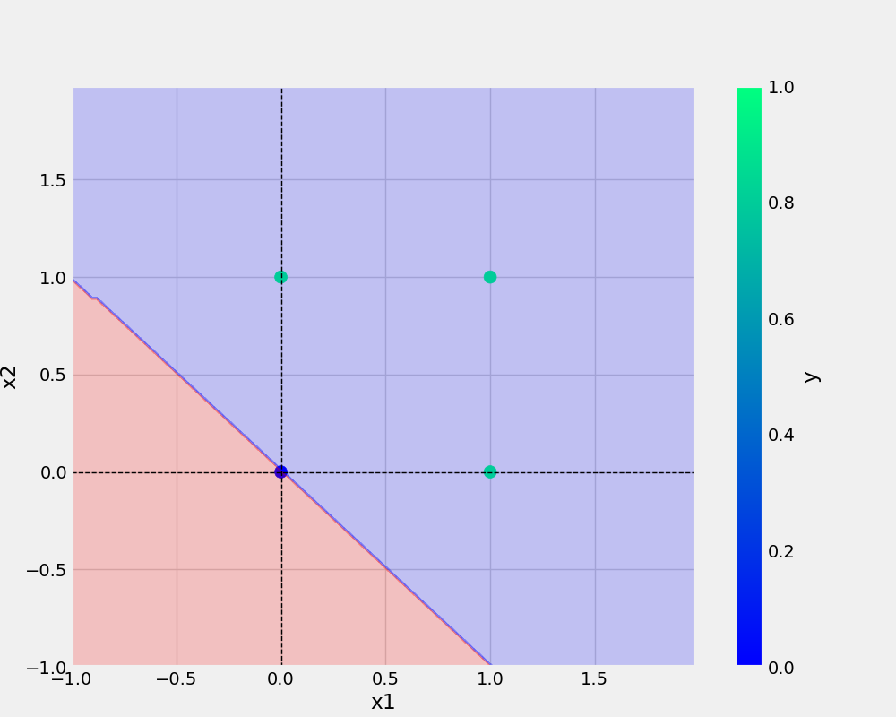

# oneNeuron
oneNeuron/perceptron

```bash
git add . && git commit -m "docstring updated" && git push origin main
```

```bash
cp Research\ notebooks/demo.ipyb .
```

## Add URL
[Git handbook](https://guides.github.com/introduction/git-handbook/)

<a href="https://www.w3schools.com">Visit W3Schools.com!</a>

## Add image 



